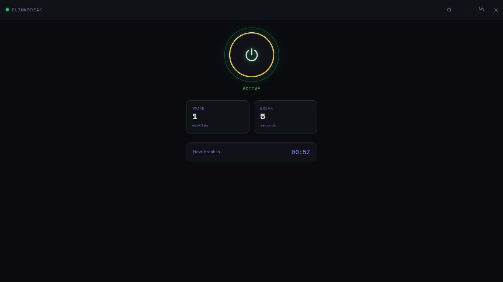

# BlinkBreak 👁️⏱️



BlinkBreak is a lightweight desktop productivity tool that reminds you to take short screen breaks during your long work sessions.

It runs quietly in the background and displays a minimal floating overlay message reminding you to pause and reset your eyes.

This app is designed especially for developers, students, and professionals who spend long hours in front of screens.

---

## ✨ Features

- ⏳ **Custom Work / Break Timer**  
  Configure how long you want to work before a break reminder appears.

- 👁️ **Eye Break Overlay**  
  A minimal floating overlay appears on screen reminding you to rest your eyes.

- ⚡ **Lightweight & Non-Intrusive**  
  Runs quietly in the background without interrupting your workflow.

- 🛠️ **Custom Messages**  
  Set your own pre-break and post-break messages.

- 💾 **Persistent Settings**  
  Your settings are saved locally and restored when the app restarts.

- 🎛️ **Simple Control Panel**  
  Start or stop the break cycle with a power button and configure settings easily.

---

## 🖥️ How It Works

1. Set your **work interval** (e.g., 20 minutes).
2. Start the **productivity cycle**.
3. After the interval, a break reminder overlay appears.
4. Follow the short countdown and take a quick eye reset.
5. Resume focus and continue working.

---

## 🚀 Download

Download the latest Windows installer:

👉 **BlinkBreak Setup**

https://github.com/ankit-j23/BlinkBreak/releases/tag/release_version_01

---

## 🛠️ Built With

- **Electron.js**
- **Node.js**
- **HTML**
- **CSS**
- **JavaScript**

---

## 📦 Installation (For Developers)

Clone the repository:

```bash
git clone https://github.com/yourusername/blinkbreak.git
cd blinkbreak

Install dependencies:

npm install

Run the application:

npm start

Build the installer:

npm run build

The installer will appear in the dist folder.

```

💡 Why I Built This

As someone who spends many hours on coding and work, I realized how easy it is to forget taking short breaks and resting our eyes.

BlinkBreak was built as a simple tool to encourage healthier screen habits while staying productive.

---

🙌 Feedback

If you try the app and have suggestions or improvements, feel free to open an issue or share feedback.

Contributions and ideas are always welcome.